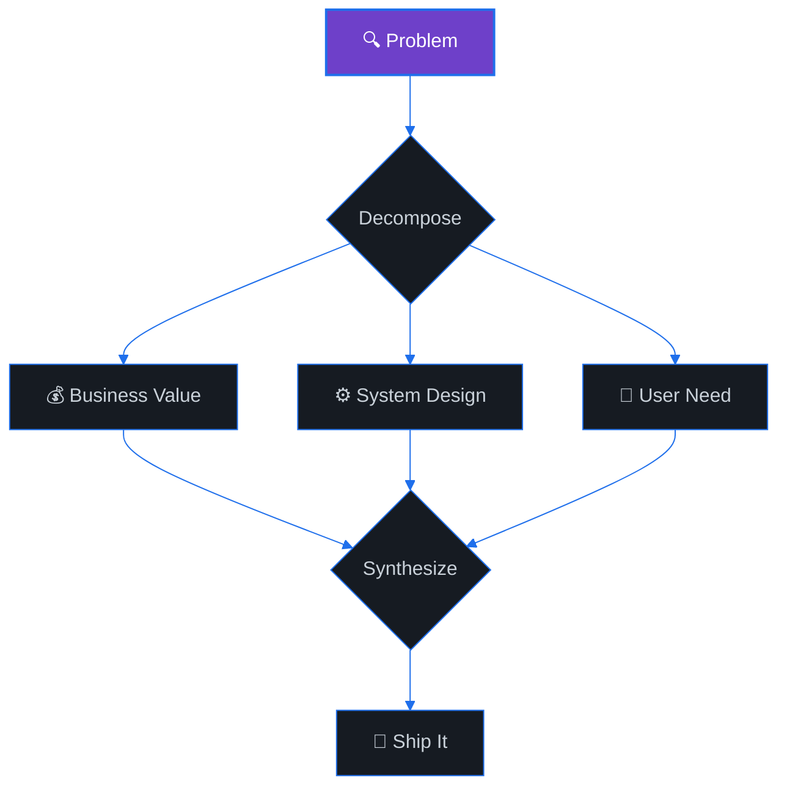

<div align="center">
  
</div>

<p align="center">
  
  &nbsp;
  <a href="https://github.com/Burtovyi?tab=followers">
    
  </a>
  &nbsp;
  <a href="https://github.com/Burtovyi?tab=repositories">
    
  </a>
</p>

<p align="center">
  
</p>

---

### &nbsp;🧑‍💻&nbsp; About Me

<div align="center">
<table>
<tr>
<td width="50%">


<br/><br/>

**⚖️ → 💻 &nbsp;From Law to Code**

Former CEO & practicing lawyer who discovered
that debugging code is more satisfying than
debugging contracts. Now I architect and ship
SaaS products **end-to-end** — from the first
`git init` to production at scale.

<br/>


</td>
<td width="50%">

```js
const oleksandr = {
  background: ["CEO", "Lawyer", "Engineer"],
  code:       ["TypeScript", "Go", "Python"],
  focus:      "SaaS Products",
  tools: {
    frontend:  ["Next.js", "React", "Tailwind"],
    backend:   ["NestJS", "Go", "Node.js"],
    data:      ["PostgreSQL", "Redis", "Meilisearch"],
    cloud:     ["AWS", "Docker", "Traefik"],
  },
  philosophy: "I don't just fix symptoms —"
            + " I find root causes.",
};
```

</td>
</tr>
</table>
</div>

---

### &nbsp;🛠️&nbsp; Tech Stack

<div align="center">

<table>
<tr>
<td align="center" width="150"><b>Frontend</b></td>
<td align="center" width="150"><b>Backend</b></td>
<td align="center" width="150"><b>Data & Storage</b></td>
<td align="center" width="150"><b>DevOps & Cloud</b></td>
<td align="center" width="150"><b>Tools</b></td>
</tr>
<tr>
<td align="center" valign="top">
  <br><sub>Next.js</sub><br>
  <br><sub>React</sub><br>
  <br><sub>TypeScript</sub><br>
  <br><sub>Tailwind</sub><br>
  <br><sub>HTML5</sub><br>
  <br><sub>CSS3 / Sass</sub>
</td>
<td align="center" valign="top">
  <br><sub>NestJS</sub><br>
  <br><sub>Node.js</sub><br>
  <br><sub>Go</sub><br>
  <br><sub>Python</sub><br>
  <br><sub>Prisma</sub><br>
  <br><sub>REST / GraphQL</sub>
</td>
<td align="center" valign="top">
  <br><sub>PostgreSQL</sub><br>
  <br><sub>Redis</sub><br>
  <br><sub>Meilisearch</sub><br>
  <br><sub>Cloudflare R2</sub><br>
  <br><sub>S3</sub>
</td>
<td align="center" valign="top">
  <br><sub>Docker</sub><br>
  <br><sub>AWS</sub><br>
  <br><sub>Traefik / Nginx</sub><br>
  <br><sub>CI / CD</sub><br>
  <br><sub>Linux</sub>
</td>
<td align="center" valign="top">
  <br><sub>Git</sub><br>
  <br><sub>VS Code</sub><br>
  <br><sub>Postman</sub><br>
  <br><sub>Figma</sub><br>
  <br><sub>Bash</sub>
</td>
</tr>
</table>

</div>

---

### &nbsp;📊&nbsp; GitHub Analytics

<div align="center">
  <picture>
    <source media="(prefers-color-scheme: dark)" srcset="https://github-readme-stats-sigma-five.vercel.app/api?username=Burtovyi&show_icons=true&hide_border=true&count_private=true&bg_color=0d1117&title_color=6e40c9&icon_color=1f6feb&text_color=c9d1d9&ring_color=6e40c9" />
    
  </picture>
  &nbsp;&nbsp;
  <picture>
    <source media="(prefers-color-scheme: dark)" srcset="https://streak-stats.demolab.com/?user=Burtovyi&hide_border=true&background=0d1117&stroke=1f6feb&ring=6e40c9&fire=6e40c9&currStreakLabel=6e40c9&sideLabels=c9d1d9&dates=8b949e&currStreakNum=c9d1d9&sideNums=c9d1d9" />
    
  </picture>
</div>

<br/>

<div align="center">
  <picture>
    <source media="(prefers-color-scheme: dark)" srcset="https://github-readme-stats-sigma-five.vercel.app/api/top-langs/?username=Burtovyi&layout=compact&hide_border=true&bg_color=0d1117&title_color=6e40c9&text_color=c9d1d9&langs_count=8" />
    
  </picture>
</div>

<br/>

<div align="center">
  
</div>

---

### &nbsp;⚡&nbsp; Activity

<div align="center">
  
</div>

---

### &nbsp;💡&nbsp; How I Think

<div align="center">



<br/>


<br/><br/>

*I don't just fix symptoms — I find root causes.*

</div>

---

### &nbsp;📫&nbsp; Let's Connect

<div align="center">

<a href="https://www.linkedin.com/in/burtovyi/" target="_blank">
  
</a>
&nbsp;
<a href="mailto:burtovyi@gmail.com">
  
</a>
&nbsp;
<a href="https://t.me/alex_burtovyi">
  
</a>

</div>

<br/>

<div align="center">
  
</div>
